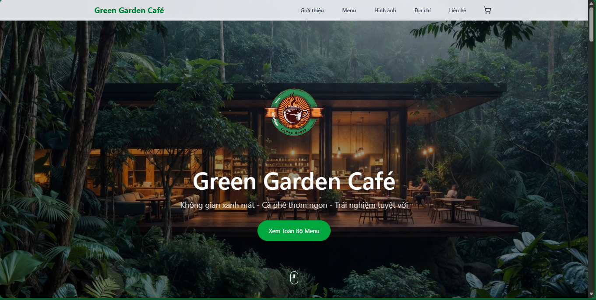
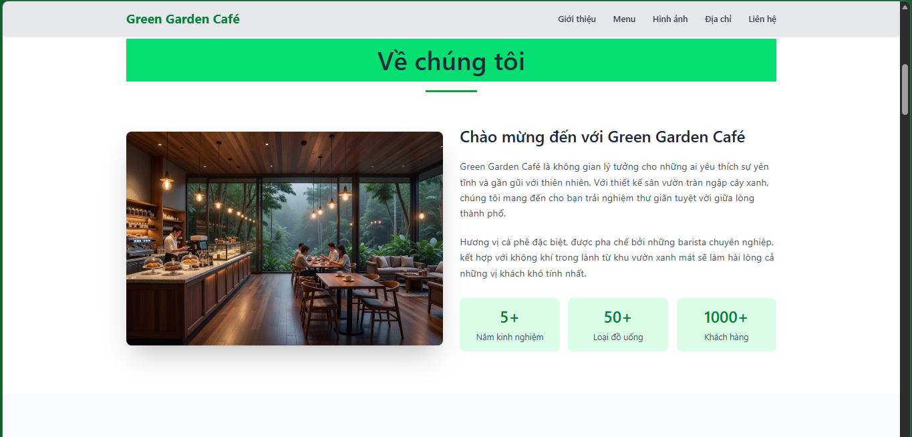
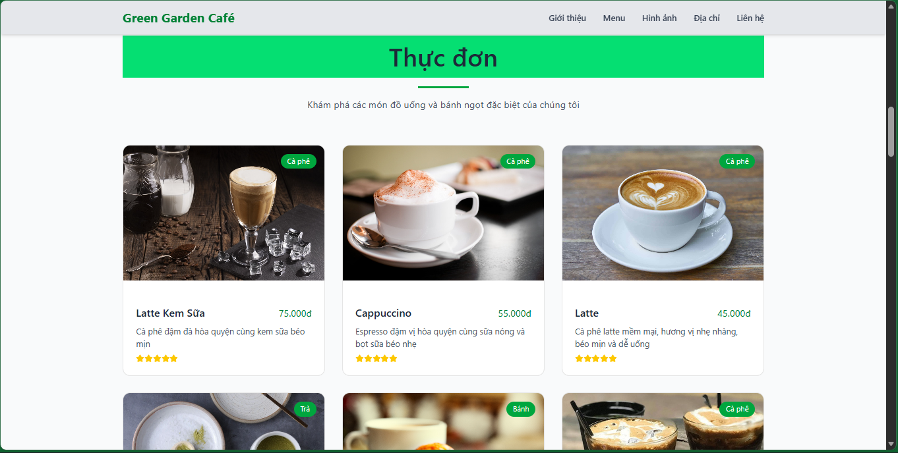
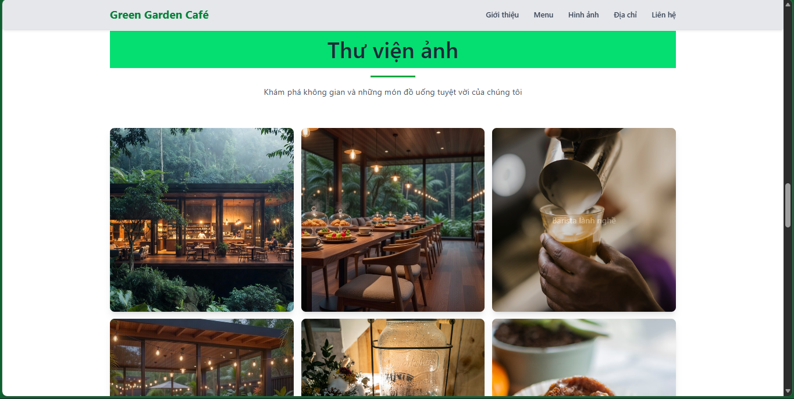
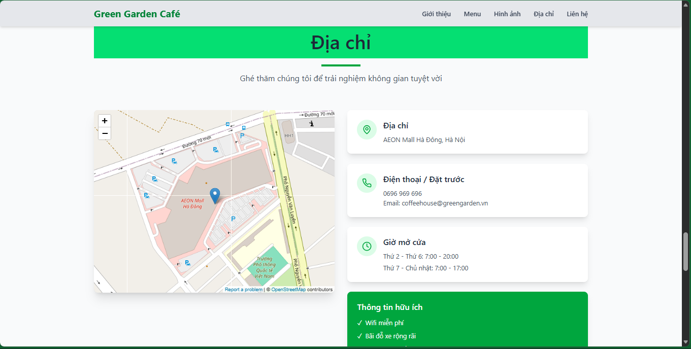
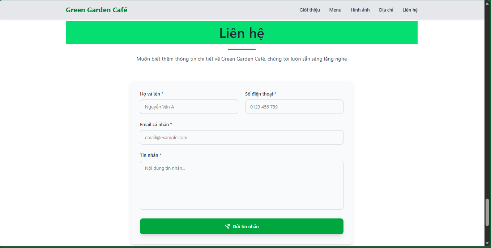
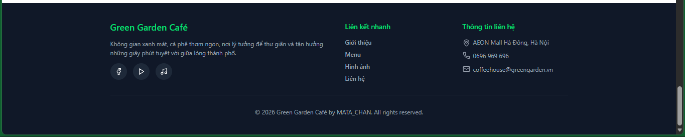
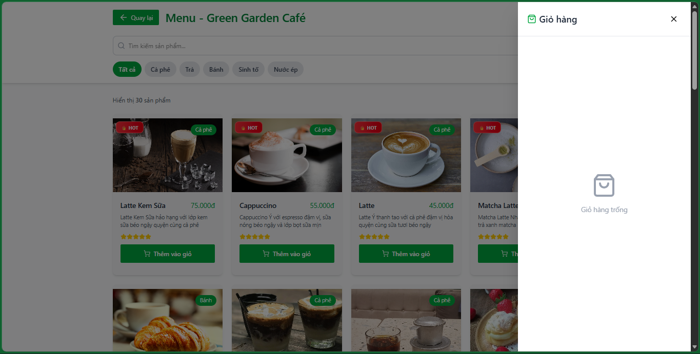
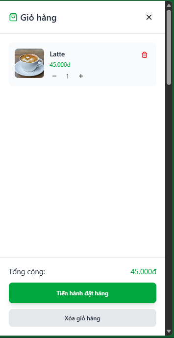
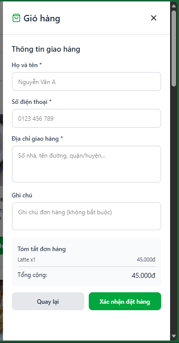

# Green Garden Café website

## Introduction

The Green Garden Café Website is a static website built to introduce a café with a green, nature-inspired, and relaxing atmosphere. The website provides information about the café, its drink and dessert menu, and the café’s location on a map so customers can easily find it.

This project focuses on creating a simple, modern, and user-friendly interface, suitable for promoting the café’s brand and image on the Internet.

## Purpose

### The main objectives of this project are:

- Introduce information about Green Garden Café

- Display the drink and dessert menu

- Provide the address and map location (OpenStreetMap / Google Maps)

- Create a good user experience with a clean and easy-to-use interface

- Practice building a static website using HTML, CSS, and JavaScript

## Features

### The website includes the following main sections:

- Home

Overview introduction of the café

Images of the café space and atmosphere

- About

The story and concept behind Green Garden Café

A green and peaceful environment suitable for relaxing or working

- Menu

Coffee drinks (Espresso, Cappuccino, Latte, Bạc Xỉu)

Other beverages

Desserts (Croissant, Macaron, Cream puffs)

- Gallery

Pictures of the café's interior and exterior

- Location

Map displaying the café’s location

Integrated OpenStreetMap

- Contact

Contact information

Opening hours

## Technologies Used

### This project uses basic web technologies:

- HTML5 – Website structure

- Tailwind CSS – User interface design

- JavaScript – Basic interactivity

- OpenStreetMap Embed – Display café location on the map

## Demo Picture

-home

-about

-menu

-gallery

-location

-contact

-footer

-menuModal

-cart

## Running the code

Run `npm i` to install the dependencies.

Run `npm run dev` to start the development server.
