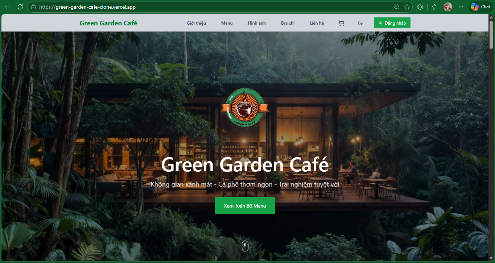
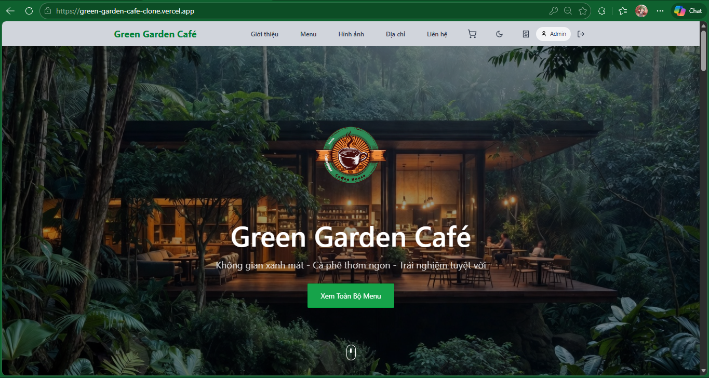
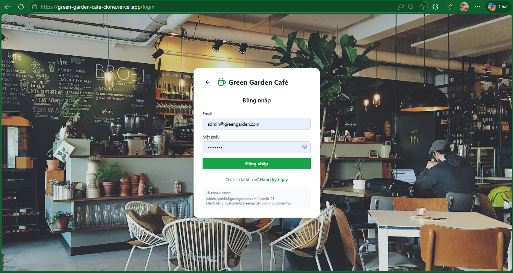
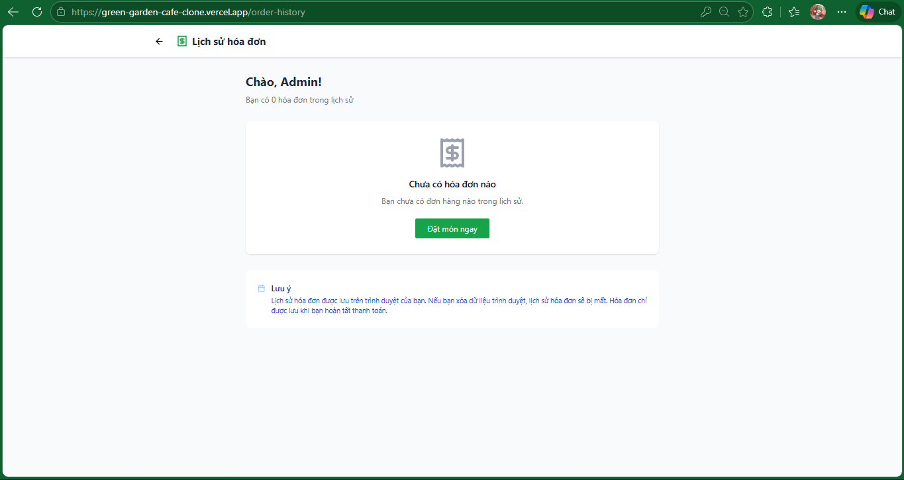
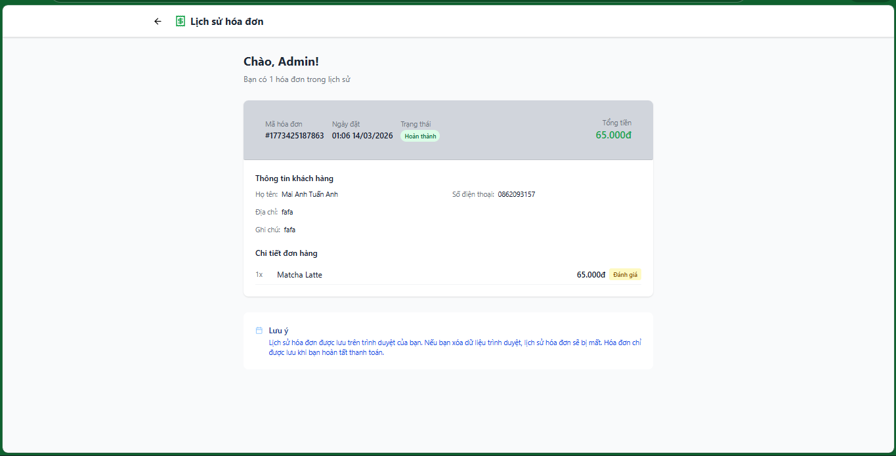

# Green Garden Café Website

## Introduction

Green Garden Café is a modern, fully-featured e-commerce café website built with React and TypeScript for serving Vietnamese customers. This digital platform showcases a nature-inspired café atmosphere while providing customers with an intuitive online ordering experience for premium coffee, beverages, and desserts.

The project demonstrates advanced frontend development capabilities with a focus on user experience, responsive design, and modern web technologies.

## Purpose

### Main objectives:

- **Brand Presentation**: Create an immersive digital experience that reflects Green Garden Café's green, peaceful atmosphere
- **E-commerce Functionality**: Enable customers to browse menu items and place orders online
- **User Experience**: Deliver a smooth, intuitive interface with modern animations and interactions
- **Responsive Design**: Ensure seamless experience across all devices (desktop, tablet, mobile)
- **Performance Optimization**: Implement fast loading times and smooth transitions

## Features

### Core Functionality

- **🏠 Home Page**
  - Hero section with compelling café introduction
  - Featured menu items with ratings
  - Interactive navigation with smooth scrolling
  - Responsive grid layout

- **📖 About Section**
  - Café story and brand philosophy
  - Atmospheric imagery showcasing the peaceful environment
  - Mission and values presentation

- **☕ Menu System**
  - **30+ Menu Items**: Coffee, tea, juices, pastries, and desserts
  - **Advanced Filtering**: By category (Cà phê, Trà, Sinh tố, Bánh, Nước ép)
  - **Search Functionality**: Real-time search across menu items
  - **Product Cards**: With ratings, prices, descriptions
  - **HOT SALE Badges**: For high-rated items (4.5+ stars)
  - **Add to Cart**: Direct from menu page

- **🛒 Shopping Cart**
  - **Slide-in Sidebar**: Smooth animation from right
  - **Quantity Management**: Increase/decrease item quantities
  - **Order Form**: Complete checkout with delivery details
  - **Price Calculation**: Real-time total updates
  - **Cart Persistence**: Maintains items during session

- **🖼️ Gallery**
  - Visual showcase of café interior and exterior
  - Responsive image grid layout
  - High-quality photography display

- **📍 Location & Contact**
  - **Interactive Map**: OpenStreetMap integration
  - **Address Display**: Clear location information
  - **Contact Form**: Customer inquiry system
  - **Business Hours**: Operating times display

### Advanced Features

- **🎨 Modern UI/UX**
  - **Smooth Animations**: Hover effects, transitions, micro-interactions
  - **Gradient Effects**: Modern visual design elements
  - **Shadow System**: Depth and hierarchy
  - **Responsive Design**: Mobile-first approach
  - **Loading States**: Professional user feedback

- **⚡ Performance Optimizations**
  - **React.memo**: Prevent unnecessary re-renders
  - **Code Splitting**: Optimized bundle sizes
  - **Image Optimization**: Efficient loading strategies
  - **Smooth Scrolling**: Hardware-accelerated animations

- **🏷️ Product Management**
  - **Rating System**: 1-5 star ratings with visual display
  - **Category System**: Organized product classification
  - **Price Formatting**: Vietnamese currency display
  - **Stock Management**: Available/unavailable status

## Technologies Used

### Frontend Stack

- **React 18** - Component-based architecture with hooks
- **TypeScript** - Type safety and better development experience
- **Tailwind CSS** - Utility-first styling framework
- **React Router** - Client-side routing and navigation
- **Lucide React** - Modern icon library

### Development Tools

- **Vite** - Fast development server and build tool
- **ESLint** - Code quality and consistency
- **PostCSS** - CSS processing and optimization

### External Services

- **OpenStreetMap** - Interactive location mapping
- **Unsplash Images** - High-quality placeholder imagery

## Project Structure

```
src/
├── app/
│   ├── components/          # Reusable UI components
│   │   ├── Navbar.tsx      # Navigation bar with cart
│   │   ├── Cart.tsx        # Shopping cart sidebar
│   │   ├── Menu.tsx        # Menu grid component
│   │   └── Location.tsx    # Map and contact
│   ├── pages/              # Main application pages
│   │   ├── HomePage.tsx     # Landing page
│   │   ├── MenuPage.tsx     # Full menu with filtering
│   │   └── AboutPage.tsx   # About section
│   ├── contexts/            # React context providers
│   │   └── CartContext.tsx # Shopping cart state
│   └── assets/             # Static assets
│       └── images/          # Product and UI images
├── public/                 # Public assets
└── index.html             # HTML template
```

## Getting Started

### Prerequisites

- Node.js 16+ installed
- npm or yarn package manager

### Installation

```bash
# Clone the repository
git clone <repository-url>

# Navigate to project directory
cd "Green Garden Café website"

# Install dependencies
npm install

# Start development server
npm run dev
```

### Available Scripts

- `npm run dev` - Start development server with hot reload
- `npm run build` - Build for production
- `npm run preview` - Preview production build
- `npm run lint` - Run ESLint for code quality

## Browser Support

- Chrome 90+
- Firefox 88+
- Safari 14+
- Edge 90+

## Performance Features

- **Fast Loading**: Optimized bundle sizes
- **Smooth Animations**: 60fps transitions
- **Responsive Images**: Efficient loading strategies
- **SEO Optimized**: Meta tags and semantic HTML
- **Accessibility**: ARIA labels and keyboard navigation

## Demo Pictures

### Website Screenshots

- **Home/Login**
  
  
  
- **About Section**
  
- **Menu Page**
  
- **Gallery Section**
  
- **Location & Map**
  
- **Contact Form**
  
- **Footer**
  
- **Menu Modal**
  
- **Shopping Cart**
  
  
- **Bill**
  
  

### UI Features

- **Product Cards with HOT SALE Badges**
- **Smooth Cart Sidebar Animation**
- **Responsive Navigation**
- **Interactive Map Integration**
- **Modern Button Design**
- **Professional Layout**

## Future Enhancements

- **Payment Integration**: Stripe/VNPay integration
- **User Accounts**: Customer profiles and order history
- **Admin Panel**: Menu management system
- **Mobile App**: React Native companion app
- **API Integration**: Backend services for real-time data

---

**Green Garden Café** - Where Nature Meets Great Coffee ☕🌿
